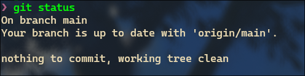
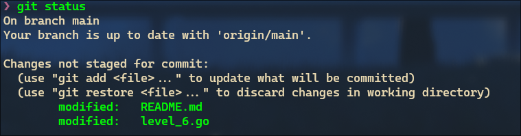

# Level 6

Task: Mark Your Attentance

>[!IMPORTANT]
> To run this task , you will need `go` installed in you system go [here](https://go.dev/doc/install) to install it. 
> ***To Run the Code***
> ```bash
> go run ./level_6.go
> ```
> You have to do what the program says to complete the task , if you do it right your attendance will be marked the remote repository.

Inorder to do this level you must have finished the previous level , beacuse in the previous level you have configured your git. If you have not properly configured your git , this may fail. And your "user.name" should match you actual name.

## How to update a repocitory. 

When you are `cloing` a repo , you are actually mirroring the repo , which means the contents of the remote repo (the repocitory that is in github) and the cloned one will be same. But when you change something in the cloned repo , like editing some file you this changes wont be reflexted to thre remote repo. So if you also want your changes to be in the remote repo you have to `push` your changes to the remote repo.

### *Why would you do that?* 
Imagine you are working on a website project with your friends , you decide to create a new login page or something , and you want to share that with everybody. Offcourse you can zip em up (make that entire file into a zip)  , but then you have to send it to everybody and when ever you make change again you have to send the zip file again. Which is not an effective way. So that whay you go about it is , you stage those file , then you commit those changes with appropriate message and all , then send it to the cloud (github repo or remote). 

#### *How to do that?*
You must have already seen `git add` , `git commit` etc , So you have to use those commands again 

```bash
git add -A
git commit -m "Your message here"
git push origin main 
```
This will add all the changes you have made and upload it to the remote repo. 

### *What if someone else has also made some changes?*
If someone else has also made some changes , and you want that to be in your local repo too, then you can simply use the command `git pull origin main` which will update your local repo with the remote repo.
>[!NOTE]
> **Things to consider**
> - If you have uncommited changes in your local repo , you should throw them away using `git stash` or commit them before pulling the changes.

#### *How to check if you have uncommited changes?*

if you run `git status` you will see something like this and it will say "nothing to commit , working tree clean" which means you have not made any changes to any file. But if you did some changes its gonna' look something like this 


You can see there are 2 files that are modified.


## Your Attendance

|Name| GitHub Username|Level 0| Level 1 | Level 2 | Level 3 | Level 4 | Level 5 | Level 6 |
|----|----------------|--------|---------|---------|---------|---------|---------|---------|
